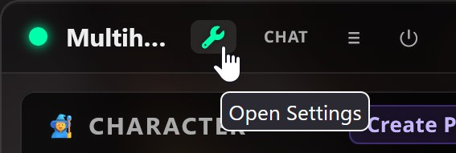
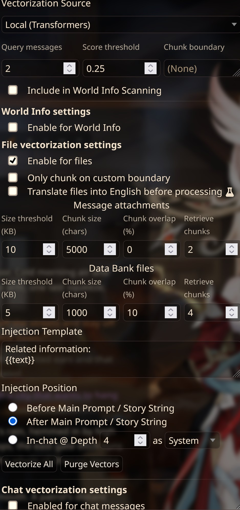

# Ironsworn with AI
- [Ironsworn with AI](#ironsworn-with-ai)
  - [Introduction](#introduction)
    - [Premise](#premise)
    - [What is this repo ?](#what-is-this-repo-)
    - [Preview and features](#preview-and-features)
  - [Requirements](#requirements)
    - [Mandatory](#mandatory)
    - [Optionnal](#optionnal)
    - [Opinionated](#opinionated)
  - [Installation](#installation)
    - [Extensions](#extensions)
    - [Mandatory](#mandatory-1)
    - [Optional](#optional)
    - [Settings](#settings)
      - [SillyTavern](#sillytavern)
      - [Multihog D\&D Framework](#multihog-dd-framework)
    - [Databank](#databank)
  - [Creating your character and campaign](#creating-your-character-and-campaign)
    - [Create you character](#create-you-character)
      - [TIME](#time)
      - [CHARACTER](#character)
      - [MOMENTUM](#momentum)
      - [VOWS](#vows)
      - [INVENTORY](#inventory)
      - [COMPANIONS and ASSETS](#companions-and-assets)
      - [BONDS](#bonds)
    - [Create your World](#create-your-world)
  - [Disclaimer](#disclaimer)
  - [Credit \& thanks](#credit--thanks)

## Introduction
### Premise
In the Ironsworn tabletop roleplaying game, you are a hero sworn to undertake perilous quests in the dark fantasy setting of the Ironlands.
Others live out their lives hardly venturing beyond the walls of their village or steading, but you are different. You will explore untracked wilds, fight desperate battles, forge bonds with isolated communities, and reveal the secrets of this harsh land.
### What is this repo ?
[Ironsworn](https://tomkinpress.com/pages/ironsworn) is lightweight TTRPG meant to be played solo or in a small group. While the author did an incredible job giving you all the tools be your own GM, you might prefer someone to create the story for you. And maybe you can't find that someone.
That is why i decided to use Sillytavern, as well at some of its extension to try and recreate the experience from behind your screen.

### Preview and features
TODO

## Requirements
Note that the installation section will guide you into setting up each of them.
### Mandatory
- [SillyTavern](https://github.com/SillyTavern/SillyTavern)
- [MultihogDnDFramework](https://github.com/MultihogAurelius/SillyTavern-MultihogDnDFramework)
- [IronswornRoll](github.com/HijackHornet/SillyTavern-IronswornRoll)
- Files from this repo
### Optionnal
- [Expression-plus](https://github.com/Tyranomaster/expressions-plus) to have companions sprites on the right
- [Auto-Music](https://github.com/virgilianshailer/AutoMusic) to generate music and SFX (requires comfyui)
- [Ikarus-auto-image](https://github.com/IkarusV/IkarusAutoImage) for its prompt post processing allowing you to define the tags of each character even with multihog

### Opinionated
For TTS i've spent weeks trying different providers and setup and i ended up using the following options. However if you have another prefered TTS provider just skip this section as its very much what I consider best (opensource, running on CPU, no VRAM, faster output than play time, but also good voice cloning).
- [Webui-TTS](https://ttswebui.com/) + [PocketTTS addon](https://github.com/HijackHornet/tts_webui_extension.pocket_tts)
- [Dialogue Voice](todo) this a vibecoded addon i did that will only work with WebUI-TTS and let you define a different voice per character

## Installation
### Extensions
Open SillyTavern and open the **Extensions** menu. Click **Install Extension**, paste each repository URL below, and install it. Refresh SillyTavern after installing the extensions.

### Mandatory
- [MultihogDnDFramework](https://github.com/MultihogAurelius/SillyTavern-MultihogDnDFramework)
- [IronswornRoll](https://github.com/HijackHornet/SillyTavern-IronswornRoll)

### Optional
- [Expression-plus](https://github.com/Tyranomaster/expressions-plus)
- [Auto-Music](https://github.com/virgilianshailer/AutoMusic)
- [Ikarus-auto-image](https://github.com/IkarusV/IkarusAutoImage)

**Expression-plus** replaces the built-in Expressions extension, so disable the built-in **Expressions** extension after installing it. 
**Auto-Music** also requires ComfyUI and its required models/workflows. 
**Ikarus-auto-image** requires an image-generation API configured in SillyTavern.

The Dialogue Voice extension mentioned above is not required for the suite and is not included in this installation guide because its repository link is not available yet.
### Settings
#### SillyTavern
**Important**: MultihogDnDFramework requires the use of ChatCompletion.

**Recommanded model**: DeepSeekV4 Flash 0731 (cheap, fast and knows the rules already)
If you want to use another model just try and test it by asking questions like "In ironsworn i am in a battle with a wolf. At what point do i win the combat ?" If the model says something like "when you complete the track you win" then it doesnt know the rules well enought to be a GM. Sure the tools provided here will guide it, and i included most of those rules into its prompt, but still its better if it already knows the basics. FYI in Ironsworn you progress on the battle track and at any point you can choose to try and roll for completing the battle, and your roll is compared to the track progress. So you dont (and usually shouldnt) have to fill the track to win.

- Enable function calling in **AI Response Configuration**. This is required for the IronswornRoll and Multihog tools.
- Use a context size of at least `18000` tokens. Recommanded `30000`
- Set the response length at `7000` tokens or higher.


#### Multihog D&D Framework
Open **Multihog D&D Framework**  under the magic wand icon then open the settings :


The cartridge supplies the Ironsworn game system, prompts, modules, and tracker configuration. In the Multihog settings, open Game Systems > Game Cartridges > Import  and use [this file](Cartridge\multihog_cartridge_ironsworn_1788811796501.json), and activate the imported **Ironsworn** profile.

Disable the following :
- World Progression > **DISABLED**
- Persistant Map > Map Updater > **DISABLED**
- Persistant Map > Map Evolution > **DISABLED**


### Databank
Open SillyTavern's **Data Bank** and import all seven PDF files from this repository's [`Databank`](Databank) folder:

- `1-The Basics_Ironsworn-Rulebook.pdf`
- `2-Your Character_Ironsworn-Rulebook.pdf`
- `3-Moves_Ironsworn-Rulebook.pdf`
- `4-Your World_Ironsworn-Rulebook.pdf`
- `5-Foes_Ironsworn-Rulebook.pdf`
- `6-Oracle_Ironsworn-Rulebook.pdf`
- `7-Gameplay_Ironsworn-Rulebook.pdf`

Import them into the global Data Bank so they are available to the campaign. Do not import the Delve rulebook; this suite is intended for the free Ironsworn base game. The above files have been trimed from example play that might confuse the AI.

In Silly tavern Extension menu, open **Vector Storage**, choose **Local**, and use the following settings.
 Don't forget **[✓]Enable for files** !

## Creating your character and campaign
### Create you character
Start by opening [`TrackerTemplates/CharacterTemplate.txt`](TrackerTemplates/CharacterTemplate.txt) and filling in a copy of it. The template follows the character sheet and character-creation rules from the Ironsworn rulebook. You can compare your result with [`TrackerTemplates/ExampleCharacter.txt`](TrackerTemplates/ExampleCharacter.txt).

When you are finished, copy the completed template into the Multihog character or state tracker area where you want to use it. Keep the section names and formatting markers such as `[CHARACTER]`, `((SLOTS))`, and `((PILL))`, because Multihog uses them to display and maintain the tracker.

#### TIME
```text
[TIME]
Current Time: 08:00, Day 1
[/TIME]
```

Set the current in-world time and day. This is the starting clock for the campaign. You can change it to fit your opening scene, but keep the `[TIME]` block in the template.

#### CHARACTER
Choose your character's name and assign the five starting stat bonuses. Ironsworn starts with these bonuses, arranged in any order:

- Edge: quickness, agility, and ranged combat
- Heart: courage, willpower, empathy, and loyalty
- Iron: strength, endurance, and close combat
- Shadow: stealth, deception, and cunning
- Wits: knowledge, expertise, and observation

Use the values `3, 2, 2, 1, 1` exactly once each. For example, the provided character uses Edge `+3`, Heart `+2`, Iron `+1`, Shadow `+2`, and Wits `+1`.

Set the starting tracks as follows:

- HP: `5/5`
- Supply: `5/5`
- Spirit: `5/5`
- Experience: `0 XP`

Health, Supply, and Spirit normally range from 0 to 5. Supply represents the shared mundane equipment and provisions of the party, so you do not need to list every ration or arrow.

#### MOMENTUM
Start with `+2/10` momentum. The standard maximum is `+10`, and the reset value is `+2`. The tracker will update momentum as moves and consequences occur. Do not add debilities when creating the character.

#### VOWS
Create exactly two starting vows:

1. An **inciting vow**, which is the immediate problem that begins the campaign. Give it a rank, usually `Troublesome`, `Dangerous`, or `Formidable`.
2. A **long-term or background vow**, which is an important personal goal. Give it a rank of `Extreme` or `Epic`.

Write each vow as a short name followed by a clear description. The description is included in prompts, so keep it specific and easy to understand. Set both progress tracks to `0/10` at the start and leave the milestone marker as `? (No milestone yet)`. The example uses **Bring peace** as its inciting vow and **Clear our names** as its long-term vow.

#### INVENTORY
Items are optional. Add only important equipment, quest items, or resources that you want to establish in the fiction. Ordinary travel gear, food, ammunition, and similar necessities are already represented by Supply. Items do not grant mechanical bonuses unless an official asset says that they do.

#### COMPANIONS and ASSETS
You need exactly **three assets total**. Use the official Ironsworn assets from the [Ironsworn Printable Asset Cards](https://tomkinpress.com/collections/free-downloads/products/ironsworn-printable-asset-cards). The four official asset types are companions, paths, combat talents, and rituals.

A companion is simply an asset with an NPC name, role, type, and its own HP track. It counts as one of your three assets. Copy the companion's three abilities from the official card, mark the first ability as active with `((PILLS))`, and mark the remaining two abilities with `🔒`. Start a companion at `5/5` HP unless the asset specifies otherwise. In the example, Alice is the companion asset, while Infiltrator and Cutthroat are the other two assets.

For each non-companion asset, copy its name, asset type, and all three abilities from the official card. Put the first selected ability after `((PILLS))` and prefix locked abilities with `🔒`. At character creation, choose the three assets that best fit the character and their story. Additional assets can be gained later through experience during play.

#### BONDS
Add exactly **three starting bonds** with people, communities, or other meaningful groups. Mark the bonds progress track with three ticks, shown in the template as `0.75/10`. Give each bond a name and type, such as `NPC`, `Community`, or `Place`. The example includes a blacksmith, a village, and an overseer.

After completing these sections, review the character-creation summary from the rulebook: choose a name, assign the `3, 2, 2, 1, 1` stats, set Health, Spirit, and Supply to `+5`, set Momentum to `+2`, choose three assets, add three bonds, record optional important items, and create the two starting vows.
### Create your World
TODO

## Disclaimer
This set of tools is meant to play Ironsworn without the [Delves](https://tomkinpress.com/pages/ironsworn-delve) extension. If you want to use the extension, you must buy it, adapt the prompts to it, and **MAKE SURE YOUR AI PROVIDER COMMIT TO NOT TRAIN ON PROMPTS**. If you feed AI with paid rulebooks you are destroying the author livelyhood. So don't be that guy... I'd say stick to the base game that is free and that AI already know the rules of. Then if you love it, buy the extension or the sequel rulebook and play without AI.
## Credit & thanks
Based on [Ironsworn](https://tomkinpress.com/pages/ironsworn) by Shawn Tomkin.
Thanks to him for making such a great game !
